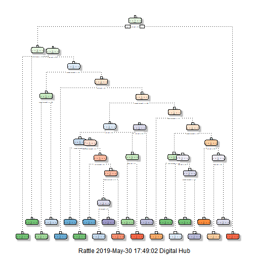

#Introduction
Using devices such as Jawbone Up, Nike FuelBand, and Fitbit it is now possible to collect a large amount of data about personal activity relatively inexpensively. These type of devices are part of the quantified self movement - a group of enthusiasts who take measurements about themselves regularly to improve their health, to find patterns in their behavior, or because they are tech geeks. One thing that people regularly do is quantify how much of a particular activity they do, but they rarely quantify how well they do it. In this project, Our goal will be to use data from accelerometers on the belt, forearm, arm, and dumbell of 6 participants. They were asked to perform barbell lifts correctly and incorrectly in 5 different ways. 


#Data
The training data for this project are available here:
<https://d396qusza40orc.cloudfront.net/predmachlearn/pml-training.csv>

The test data are available here:
<https://d396qusza40orc.cloudfront.net/predmachlearn/pml-testing.csv>

The data for this project come from this source:
<http://groupware.les.inf.puc-rio.br/har>


#Data processing

###Loading packages


```r
library(caret)
library(rpart)
library(rattle)
library(randomForest)
```

###Reading data
Set seed so that this can be reproduced. Reading the data.


```r
set.seed(126)
training <- read.csv("pml-training.csv",na.strings = c("#DIV/0!","NA",""))
testing <- read.csv("pml-testing.csv",na.strings = c("#DIV/0!","NA",""))
```

### Cleaning data
Some of the data has NAs. We are only selecting data where there is totally no invalid info.


```r
training <-training[,colSums(is.na(training))==0]
testing <-testing[,colSums(is.na(testing))==0]
```

Removing the identifying columns which we do not use for this analysis, for example username, date, etc.


```r
training <- training[,-c(1:7)]
testing <- testing[,-c(1:7)]
```

### Creating the train set and test set
Train set and test set are created using the training data.
60% of training data is used for train set, while remaining 40% for test set.


```r
inTrain <- createDataPartition(training$classe, p = 0.60, list = FALSE)
TrainSet = training[ inTrain,]
TestSet = training[-inTrain,]
dim(TrainSet)
```

```
## [1] 11776    53
```

```r
dim(TestSet)
```

```
## [1] 7846   53
```

#Model Fitting 1 - Desicion Tree
First, we try to fit the model using decision tree method.


```r
modelTree <- rpart(classe ~ .,data = TrainSet, method = "class")
fancyRpartPlot(modelTree)
```

```
## Warning: labs do not fit even at cex 0.15, there may be some overplotting
```



We then use the model to predict our test set.


```r
predictTree <- predict(modelTree, newdata = TestSet, type = "class")
confusionMatrix(predictTree,TestSet$classe)
```

```
## Confusion Matrix and Statistics
## 
##           Reference
## Prediction    A    B    C    D    E
##          A 1936  216   62   74   35
##          B   97 1004  137  103  132
##          C   34  198  925  124  149
##          D  111   64  229  940  151
##          E   54   36   15   45  975
## 
## Overall Statistics
##                                           
##                Accuracy : 0.7367          
##                  95% CI : (0.7268, 0.7464)
##     No Information Rate : 0.2845          
##     P-Value [Acc > NIR] : < 2.2e-16       
##                                           
##                   Kappa : 0.6667          
##                                           
##  Mcnemar's Test P-Value : < 2.2e-16       
## 
## Statistics by Class:
## 
##                      Class: A Class: B Class: C Class: D Class: E
## Sensitivity            0.8674   0.6614   0.6762   0.7309   0.6761
## Specificity            0.9311   0.9259   0.9220   0.9154   0.9766
## Pos Pred Value         0.8334   0.6816   0.6469   0.6288   0.8667
## Neg Pred Value         0.9464   0.9193   0.9310   0.9455   0.9305
## Prevalence             0.2845   0.1935   0.1744   0.1639   0.1838
## Detection Rate         0.2467   0.1280   0.1179   0.1198   0.1243
## Detection Prevalence   0.2961   0.1877   0.1823   0.1905   0.1434
## Balanced Accuracy      0.8992   0.7936   0.7991   0.8232   0.8264
```

#Model Fitting 2 - Random Forest

Next, we try to fit the model using random forest method.


```r
modelForest <- randomForest(classe ~ ., data = TrainSet)
predictForest <- predict(modelForest, newdata = TestSet, type = "class")
confusionMatrix(predictForest,TestSet$classe)
```

```
## Confusion Matrix and Statistics
## 
##           Reference
## Prediction    A    B    C    D    E
##          A 2227   12    0    0    0
##          B    5 1504    1    0    0
##          C    0    2 1361   11    1
##          D    0    0    6 1274    3
##          E    0    0    0    1 1438
## 
## Overall Statistics
##                                           
##                Accuracy : 0.9946          
##                  95% CI : (0.9928, 0.9961)
##     No Information Rate : 0.2845          
##     P-Value [Acc > NIR] : < 2.2e-16       
##                                           
##                   Kappa : 0.9932          
##                                           
##  Mcnemar's Test P-Value : NA              
## 
## Statistics by Class:
## 
##                      Class: A Class: B Class: C Class: D Class: E
## Sensitivity            0.9978   0.9908   0.9949   0.9907   0.9972
## Specificity            0.9979   0.9991   0.9978   0.9986   0.9998
## Pos Pred Value         0.9946   0.9960   0.9898   0.9930   0.9993
## Neg Pred Value         0.9991   0.9978   0.9989   0.9982   0.9994
## Prevalence             0.2845   0.1935   0.1744   0.1639   0.1838
## Detection Rate         0.2838   0.1917   0.1735   0.1624   0.1833
## Detection Prevalence   0.2854   0.1925   0.1752   0.1635   0.1834
## Balanced Accuracy      0.9978   0.9949   0.9964   0.9946   0.9985
```

Accuracy result:

- Decision tree = 0.7367
- Random forest = 0.995

Based on the accuracy result, random forest is a better model with higher accuracy.

#Prediction
We will use the random forest model to predict the test data as shown below.


```r
predictTest <- predict(modelForest, newdata = testing)
predictTest
```

```
##  1  2  3  4  5  6  7  8  9 10 11 12 13 14 15 16 17 18 19 20 
##  B  A  B  A  A  E  D  B  A  A  B  C  B  A  E  E  A  B  B  B 
## Levels: A B C D E
```
